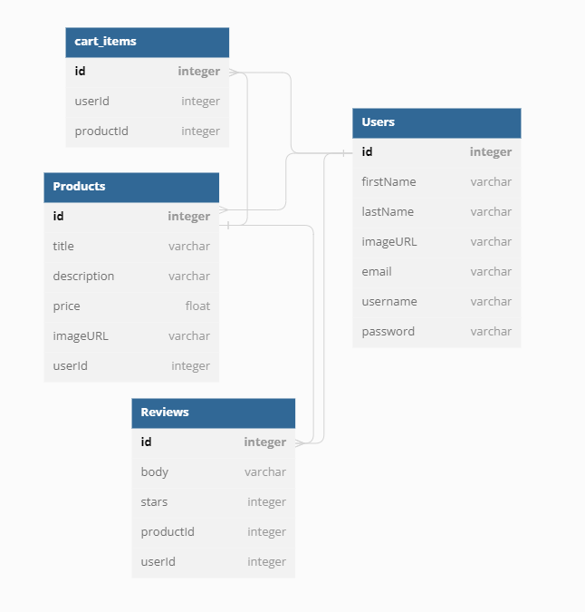

## Database Schema Design

# Backend Routes

## Product Listings

1.
--- Create a new product
* Route/URL - "/products"
* Method - POST
* Status code - 201

2.
--- Get all products
* Route/URL - "/products"
* Method - GET
* Status code - 200

3.
--- Get a product by ID
* Route/URL - "/products/:productId"
* Method - GET
* Status code - 200

4.
--- Edit a product by ID
* Route/URL - "/products/:productId/edit"
* Method - PUT
* Status code - 200

5.
--- Delete a product by ID
* Route/URL - "/products/:productId"
* Method - DELETE
* Status code - 200

 ## Reviews

 1.
--- Create a new review
* Route/URL - "/products/:productId/reviews"
* Method - POST
* Status code - 201

2.
--- Get all reviews
* Route/URL - "/products/:productId/reviews"
* Method - GET
* Status code - 200

3.
--- Edit a review by ID
* Route/URL - "/products/:productId/review/:reviewId/edit"
* Method - PUT
* Status code - 200

4.
--- Delete a review by ID
* Route/URL - "/products/:productId/review/:reviewId"
* Method - DELETE
* Status code - 200

## Shopping Cart

1.
--- Get all cart items
* Route/URL - "/cart-items"
* Method - GET
* Status code - 200

2.
--- Add cart item 
* Route/URL - "/cart-items"
* Method - POST
* Status code - 200

3. 
--- Delete cart item
* Route/URL - "/cart-items/:cart_item_id"
* Method - DELETE
* Status code - 200

## Search

1.
--- Get product by name
* Route/URL - "/get/products/?name"
* Parameters -
    + Product names
    + Products within a price range
* Method - GET
* Status code - 200