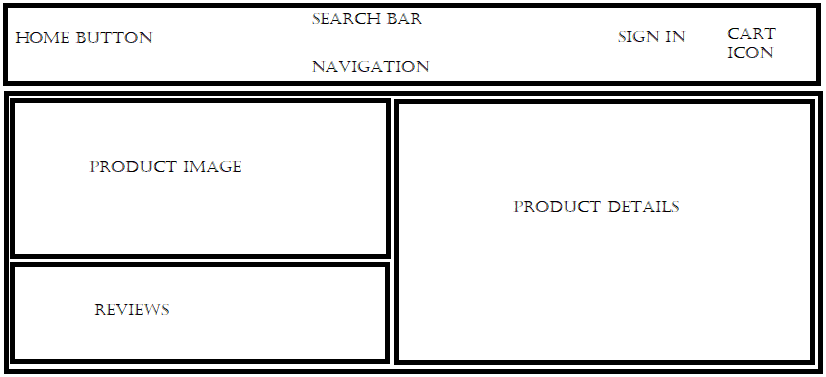

This project was bootstrapped with [Create React App](https://github.com/facebook/create-react-app).


Your React App will live here.  You will need to run `npm install` to install all your dependencies before starting up the application. While in development, run this application from this location using `npm start`.

No environment variables are needed to run this application in development, but be sure to set the REACT_APP_BASE_URL environment variable when you deploy!

This app will be automatically built when you push to your main branch on Github.

to run this app make sure you have first followed the instructions in the root README.md

then its as simple as running the following code in your terminal at the root directory ->

```
flask run --port=8000
```

lastly run the following code in the terminal under the "Group-Etsy/react-app" directory ->

```
npm start
```

your browser should then automatically open up the application.



